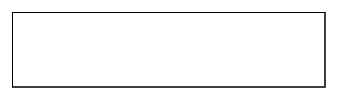

# Part Association

## Definition

```
{
  _style: 'verticalAlign=bottom;html=1;endArrow=open;endSize=12;edgeStyle=orthogonalEdgeStyle;startFill=1;startSize=12;startArrow=diamondThin;',
  _width: 250,
  _height: 0,
}
```

## Usage

```
import { PartAssociation } from '@reactiac/standard-components-diagrams/sysmlBlocks'

<PartAssociation/>
```

## Preview


