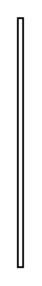

# Participant Property 2

## Definition

```
{
  _style: { 
    entity: 'edgeStyle=none;html=1;endArrow=none;verticalAlign=bottom;',
  },
  _original_width: 3,
  _original_height: 140,
}
```

## Usage

```
import { ParticipantProperty2 } from '@dinghy/standard-components-diagrams/sysmlBlocks'

<ParticipantProperty2/>
```

## Preview


