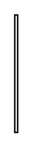

# Participant Property 4

## Definition

```
{
  _style: { 
    entity: 'shape=rect;html=1;whiteSpace=wrap;',
  },
  _original_width: 2,
  _original_height: 80,
}
```

## Usage

```
import { ParticipantProperty4 } from '@dinghy/standard-components-diagrams/sysmlBlocks'

<ParticipantProperty4/>
```

## Preview


