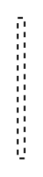

# Participant Property 6

## Definition

```
{
  _style: 'edgeStyle=none;html=1;endArrow=none;dashed=1;rounded=0;',
  _width: 4,
  _height: 80,
}
```

## Usage

```
import { ParticipantProperty6 } from '@reactiac/standard-components-diagrams/sysmlBlocks'

<ParticipantProperty6/>
```

## Preview


