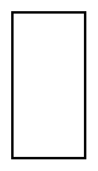

# Property

## Definition

```
{
  _style: { 
    entity: 'shape=rect;html=1;strokeWidth=2;whiteSpace=wrap;recursiveResize=0;',
  },
  _width: 0,
  _height: 120,
}
```

## Usage

```
import { Property } from '@diac/standard-components-diagrams/sysmlBlocks'

<Property/>
```

## Preview


