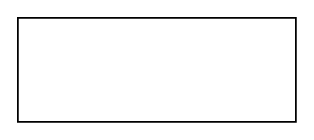

# Relation 2

## Definition

```
{
  _style: { 
    entity: 'verticalAlign=bottom;html=1;endArrow=none;startArrow=none;startSize=14;startFill=0;edgeStyle=orthogonalEdgeStyle;',
  },
  _width: 160,
  _height: 0,
}
```

## Usage

```
import { Relation2 } from '@diac/standard-components-diagrams/sysmlBlocks'

<Relation2/>
```

## Preview


