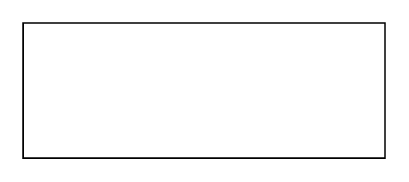

# Relation

## Definition

```
{
  _style: { 
    entity: 'align=right;html=1;verticalAlign=bottom;endArrow=none;startArrow=diamondThin;startSize=14;startFill=1;edgeStyle=none;',
  },
  _original_width: 160,
  _original_height: 0,
}
```

## Usage

```
import { Relation } from '@diac/standard-components-diagrams/sysmlBlocks'

<Relation/>
```

## Preview


