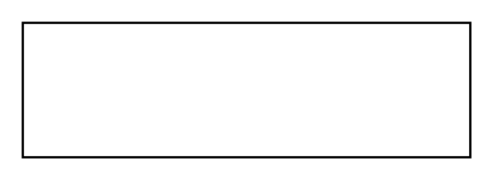

# Unit

## Definition

```
{
  _style: { 
    entity: 'shape=rect;html=1;overflow=fill;whiteSpace=wrap;',
  },
  _width: 200,
  _height: 60,
}
```

## Usage

```
import { Unit } from '@diac/standard-components-diagrams/sysmlBlocks'

<Unit/>
```

## Preview


