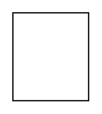
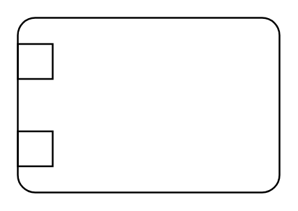
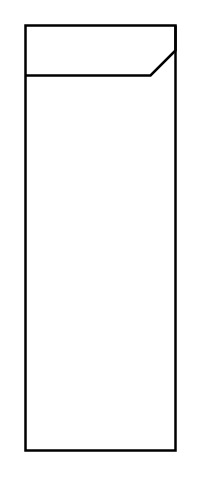

# Sysml Constraint Blocks Entities

- [ConstraintBlock](./constraint-block.md)  

- [ConstraintProperty](./constraint-property.md)  

- [ConstraintProperty2](./constraint-property-2.md)  

- [ParametricDiagram](./parametric-diagram.md)  

