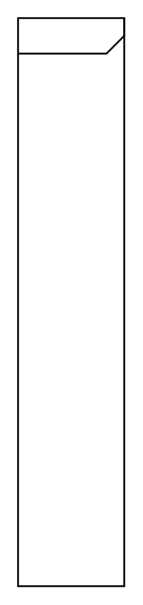

# Combined Fragment

## Definition

```
{
  _style: 'html=1;shape=mxgraph.sysml.package;labelX=100;html=1;overflow=fill;strokeWidth=1;recursiveResize=0;',
  _width: 0,
  _height: 320,
}
```

## Usage

```
import { CombinedFragment } from '@reactiac/standard-components-diagrams/sysmlInteractions'

<CombinedFragment/>
```

## Preview


