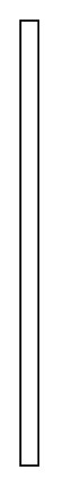

# Creation/Destruction Event 5

## Definition

```
{
  _style: 'edgeStyle=elbowEdgeStyle;endArrow=open;elbow=vertical;endSize=12;html=1;rounded=0;',
  _width: 9,
  _height: 220,
}
```

## Usage

```
import { CreationDestructionEvent5 } from '@diac/standard-components-diagrams/sysmlInteractions'

<CreationDestructionEvent5/>
```

## Preview


