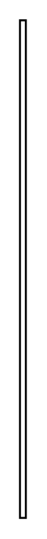

# Duration Constraint 3

## Definition

```
{
  _style: { 
    entity: 'edgeStyle=none;html=1;endArrow=open;verticalAlign=bottom;endSize=12;',
  },
  _original_width: 3,
  _original_height: 250,
}
```

## Usage

```
import { DurationConstraint3 } from '@diac/standard-components-diagrams/sysmlInteractions'

<DurationConstraint3/>
```

## Preview


