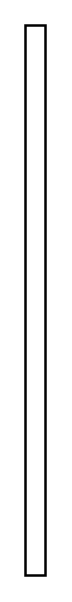
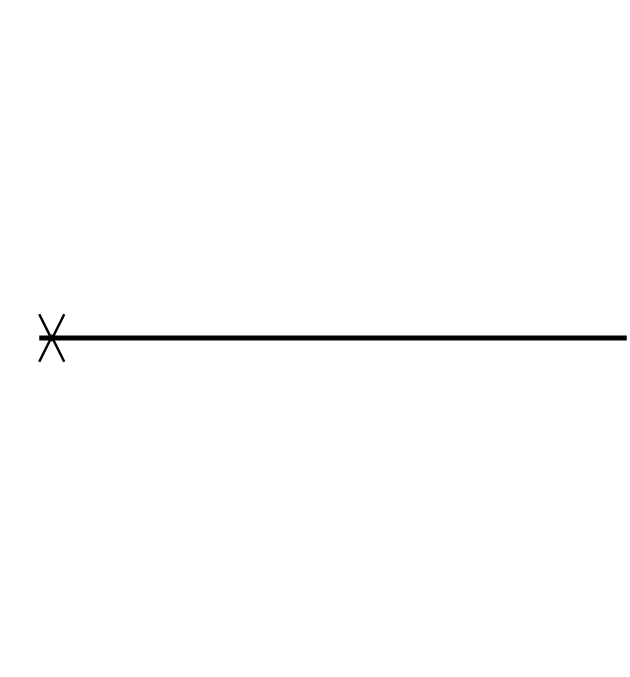
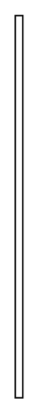
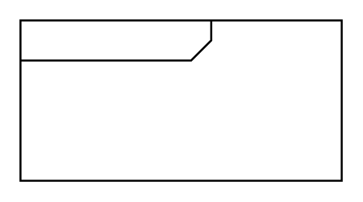

# Sysml Interactions Entities

- [CombinedFragment](./combined-fragment.md)  

- [Coregion](./coregion.md)  

- [Coregion2](./coregion-2.md)  

- [Coregion3](./coregion-3.md)  

- [Coregion4](./coregion-4.md)  

- [CreationDestructionEvent](./creation-destruction-event.md)  

- [CreationDestructionEvent2](./creation-destruction-event-2.md)  

- [CreationDestructionEvent3](./creation-destruction-event-3.md)  

- [CreationDestructionEvent4](./creation-destruction-event-4.md)  

- [CreationDestructionEvent5](./creation-destruction-event-5.md)  

- [CreationDestructionEvent6](./creation-destruction-event-6.md)  

- [DurationConstraint](./duration-constraint.md)  

- [DurationConstraint2](./duration-constraint-2.md)  

- [DurationConstraint3](./duration-constraint-3.md)  

- [DurationConstraint4](./duration-constraint-4.md)  

- [DurationConstraint5](./duration-constraint-5.md)  

- [ExecutionSpecification](./execution-specification.md)  

- [ExecutionSpecification2](./execution-specification-2.md)  

- [InteractionUse](./interaction-use.md)  

- [Lifeline](./lifeline.md)  

- [Lifeline2](./lifeline-2.md)  

- [Message](./message.md)  

- [Message2](./message-2.md)  

- [Message3](./message-3.md)  

- [SequenceDiagram](./sequence-diagram.md)  

- [StateInvariantContinuations](./state-invariant-continuations.md)  

- [TimeConstraint](./time-constraint.md)  

- [TimeConstraint2](./time-constraint-2.md)  

