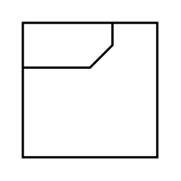

# Interaction Use

## Definition

```
{
  _style: { 
    entity: 'html=1;shape=mxgraph.sysml.package;labelX=40;whiteSpace=wrap;align=center;',
  },
  _original_width: 0,
  _original_height: 60,
}
```

## Usage

```
import { InteractionUse } from '@diac/standard-components-diagrams/sysmlInteractions'

<InteractionUse/>
```

## Preview


