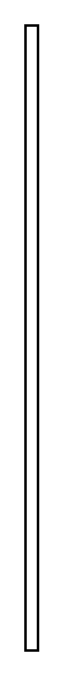

# Message 2

## Definition

```
{
  _style: { 
    entity: 'edgeStyle=none;html=1;endArrow=block;verticalAlign=bottom;endSize=12;endFill=1;',
  },
  _width: 5,
  _height: 250,
}
```

## Usage

```
import { Message2 } from '@diac/standard-components-diagrams/sysmlInteractions'

<Message2/>
```

## Preview


