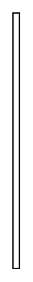

# Time Constraint 2

## Definition

```
{
  _style: { 
    entity: 'edgeStyle=none;html=1;endArrow=none;align=left;labelBackgroundColor=none;',
  },
  _original_width: 5,
  _original_height: 200,
}
```

## Usage

```
import { TimeConstraint2 } from '@diac/standard-components-diagrams/sysmlInteractions'

<TimeConstraint2/>
```

## Preview


