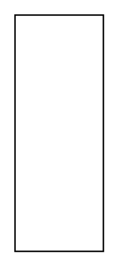

# Sysml Model Elements Entities

- [Comment](./comment.md)  

- [Comment2](./comment-2.md)  

- [Comment3](./comment-3.md)  

- [ConstraintTextualNote](./constraint-textual-note.md)  

- [ConstraintTextualNote2](./constraint-textual-note-2.md)  

- [FlowDirection](./flow-direction.md)  

- [FlowDirection2](./flow-direction-2.md)  

- [Model](./model.md)  

- [PackageName](./package-name.md)  

- [PackageTab](./package-tab.md)  

- [PackageDiagram](./package-diagram.md)  

- [View](./view.md)  

- [ViewName](./view-name.md)  

- [Viewpoint](./viewpoint.md)  

