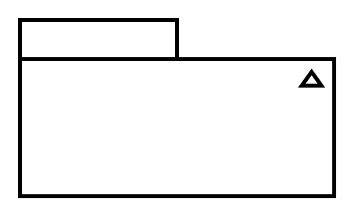

# Model

## Definition

```
{
  _style: { 
    entity: 'html=1;shape=mxgraph.sysml.composite;symbol0=folder;fontStyle=1;spacingTop=15;tabWidth=80;tabHeight=20;tabPosition=left;symbol1=triangle;symbol1Width=7;symbol1Height=10;symbol1Align=right;symbol1VerticalAlign=top;symbol1Spacing=8;symbol1VSpacing=25;symbol1Direction=north;strokeWidth=2;whiteSpace=wrap;align=center;',
  },
  _original_width: 160,
  _original_height: 90,
}
```

## Usage

```
import { Model } from '@diac/standard-components-diagrams/sysmlModelElements'

<Model/>
```

## Preview


