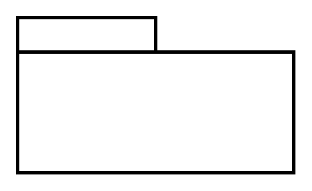

# Package (Name)

## Definition

```
{
  _style: 'shape=folder;tabWidth=80;tabHeight=20;tabPosition=left;strokeWidth=2;html=1;whiteSpace=wrap;align=center;',
  _width: 160,
  _height: 90,
}
```

## Usage

```
import { PackageName } from '@reactiac/standard-components-diagrams/sysmlModelElements'

<PackageName/>
```

## Preview


