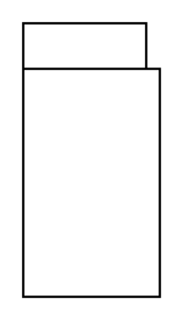

# Package (Tab)

## Definition

```
{
  _style: { 
    entity: 'shape=folder;xSize=90;align=left;spacingLeft=10;align=left;verticalAlign=top;spacingLeft=5;spacingTop=-4;tabWidth=70;tabHeight=20;tabPosition=left;html=1;recursiveResize=0;',
  },
  _original_width: 0,
  _original_height: 120,
}
```

## Usage

```
import { PackageTab } from '@diac/standard-components-diagrams/sysmlModelElements'

<PackageTab/>
```

## Preview


