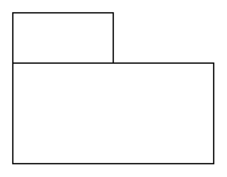

# View

## Definition

```
{
  _style: { 
    entity: 'shape=folder;html=1;tabWidth=80;tabHeight=40;tabPosition=left;align=left;verticalAlign=top;spacingLeft=10;whiteSpace=wrap;',
  },
  _width: 160,
  _height: 120,
}
```

## Usage

```
import { View } from '@diac/standard-components-diagrams/sysmlModelElements'

<View/>
```

## Preview


