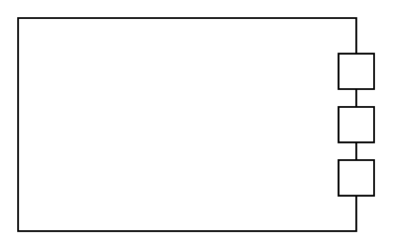

# Item Flow 10

## Definition

```
{
  _style: { 
    entity: 'html=1;shape=mxgraph.sysml.itemFlowRight;fontStyle=1;whiteSpace=wrap;align=center;',
  },
  _original_width: 200,
  _original_height: 120,
}
```

## Usage

```
import { ItemFlow10 } from '@dinghy/standard-components-diagrams/sysmlPortsAndFlows'

<ItemFlow10/>
```

## Preview


