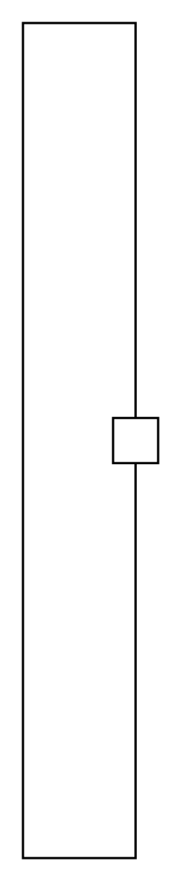

# Item Flow 4

## Definition

```
{
  _style: 'html=1;shape=mxgraph.sysml.itemFlow;fontStyle=1;flowDir=e;flowType=none;spacingRight=20;whiteSpace=wrap;align=center;',
  _width: 0,
  _height: 370,
}
```

## Usage

```
import { ItemFlow4 } from '@reactiac/standard-components-diagrams/sysmlPortsAndFlows'

<ItemFlow4/>
```

## Preview


