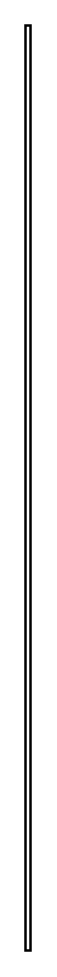

# Item Flow 6

## Definition

```
{
  _style: { 
    entity: 'edgeStyle=none;html=1;align=left;verticalAlign=top;endArrow=none;exitX=1;exitY=0.5;entryX=0;entryY=0.5;',
  },
  _original_width: 2,
  _original_height: 370,
}
```

## Usage

```
import { ItemFlow6 } from '@diac/standard-components-diagrams/sysmlPortsAndFlows'

<ItemFlow6/>
```

## Preview


