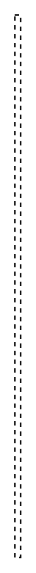

# Item Flow 8

## Definition

```
{
  _style: 'endArrow=none;html=1;edgeStyle=elbowEdgeStyle;elbow=horizontal;dashed=1;',
  _width: 4,
  _height: 370,
}
```

## Usage

```
import { ItemFlow8 } from '@reactiac/standard-components-diagrams/sysmlPortsAndFlows'

<ItemFlow8/>
```

## Preview


