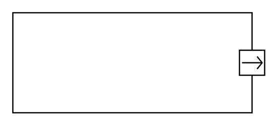

# Item Flow East Out

## Definition

```
{
  _style: { 
    entity: 'html=1;shape=mxgraph.sysml.itemFlow;fontStyle=1;flowDir=e;flowType=out;whiteSpace=wrap;align=center;',
  },
  _original_width: 200,
  _original_height: 80,
}
```

## Usage

```
import { ItemFlowEastOut } from '@dinghy/standard-components-diagrams/sysmlPortsAndFlows'

<ItemFlowEastOut/>
```

## Preview


