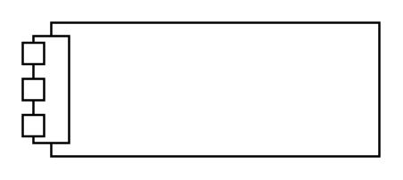

# Nested Port

## Definition

```
{
  _style: 'html=1;shape=mxgraph.sysml.nestedPort;fontStyle=1;whiteSpace=wrap;align=center;',
  _width: 160,
  _height: 60,
}
```

## Usage

```
import { NestedPort } from '@diac/standard-components-diagrams/sysmlPortsAndFlows'

<NestedPort/>
```

## Preview


