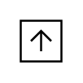

# Port, Flow North

## Definition

```
{
  _style: { 
    entity: 'html=1;shape=mxgraph.sysml.port;sysMLPortType=flowN;',
  },
  _original_width: 20,
  _original_height: 20,
}
```

## Usage

```
import { PortFlowNorth } from '@diac/standard-components-diagrams/sysmlPortsAndFlows'

<PortFlowNorth/>
```

## Preview


