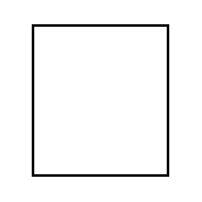

# Port

## Definition

```
{
  _style: 'html=1;shape=mxgraph.sysml.port1;fontStyle=1;whiteSpace=wrap;align=center;points=[[0,0.5,0],[1,0.5,0]];',
  _width: 0,
  _height: 60,
}
```

## Usage

```
import { Port } from '@reactiac/standard-components-diagrams/sysmlPortsAndFlows'

<Port/>
```

## Preview


