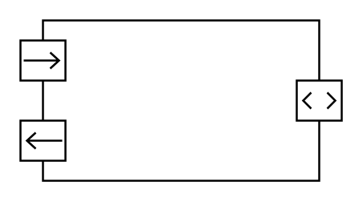

# Ports with Flow Properties

## Definition

```
{
  _style: 'html=1;shape=mxgraph.sysml.port3;fontStyle=1;whiteSpace=wrap;align=center;',
  _width: 160,
  _height: 80,
}
```

## Usage

```
import { PortsWithFlowProperties } from '@reactiac/standard-components-diagrams/sysmlPortsAndFlows'

<PortsWithFlowProperties/>
```

## Preview


