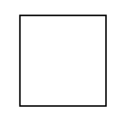

# Required Interface

## Definition

```
{
  _style: 'html=1;shape=mxgraph.sysml.port4;fontStyle=1;whiteSpace=wrap;align=center;',
  _width: 0,
  _height: 60,
}
```

## Usage

```
import { RequiredInterface } from '@reactiac/standard-components-diagrams/sysmlPortsAndFlows'

<RequiredInterface/>
```

## Preview


