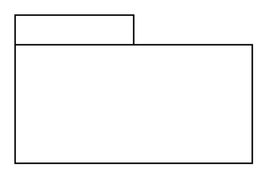

# Profile

## Definition

```
{
  _style: { 
    entity: 'shape=folder;tabWidth=80;tabHeight=20;tabPosition=left;html=1;whiteSpace=wrap;align=center;',
  },
  _width: 160,
  _height: 100,
}
```

## Usage

```
import { Profile } from '@diac/standard-components-diagrams/sysmlProfiles'

<Profile/>
```

## Preview


