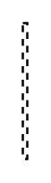

# Derive Dependency

## Definition

```
{
  _style: { 
    entity: 'endArrow=open;html=1;edgeStyle=none;endSize=12;dashed=1;',
  },
  _original_width: 2,
  _original_height: 60,
}
```

## Usage

```
import { DeriveDependency } from '@diac/standard-components-diagrams/sysmlRequirements'

<DeriveDependency/>
```

## Preview


