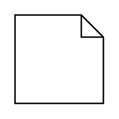

# Master Callout

## Definition

```
{
  _style: 'shape=note;html=1;size=15;align=left;spacingLeft=5;whiteSpace=wrap;align=center;',
  _width: 0,
  _height: 60,
}
```

## Usage

```
import { MasterCallout } from '@reactiac/standard-components-diagrams/sysmlRequirements'

<MasterCallout/>
```

## Preview


