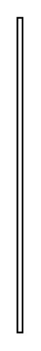

# Requirement Containment Relationship 2

## Definition

```
{
  _style: { 
    entity: 'rounded=0;html=1;labelBackgroundColor=none;endArrow=none;edgeStyle=elbowEdgeStyle;elbow=vertical;startArrow=sysMLPackCont;startSize=12;',
  },
  _original_width: 3,
  _original_height: 180,
}
```

## Usage

```
import { RequirementContainmentRelationship2 } from '@dinghy/standard-components-diagrams/sysmlRequirements'

<RequirementContainmentRelationship2/>
```

## Preview


