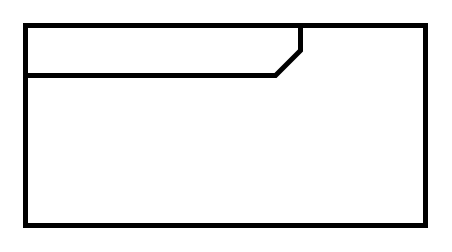

# Requirement Diagram

## Definition

```
{
  _style: { 
    entity: 'html=1;shape=mxgraph.sysml.package;overflow=fill;labelX=110;strokeWidth=2;align=center;',
  },
  _original_width: 160,
  _original_height: 80,
}
```

## Usage

```
import { RequirementDiagram } from '@dinghy/standard-components-diagrams/sysmlRequirements'

<RequirementDiagram/>
```

## Preview


