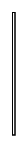

# Choice Pseudo State 3

## Definition

```
{
  _style: { 
    entity: 'edgeStyle=elbowEdgeStyle;html=1;elbow=vertical;align=right;endArrow=open;rounded=0;labelBackgroundColor=none;endSize=12;',
  },
  _original_width: 2,
  _original_height: 100,
}
```

## Usage

```
import { ChoicePseudoState3 } from '@dinghy/standard-components-diagrams/sysmlStateMachines'

<ChoicePseudoState3/>
```

## Preview


