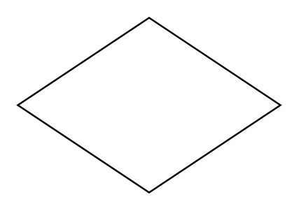

# Choice Pseudo State

## Definition

```
{
  _style: 'shape=rhombus;html=1;labelPosition=right;align=left;verticalAlign=middle',
  _width: 150,
  _height: 100,
}
```

## Usage

```
import { ChoicePseudoState } from '@reactiac/standard-components-diagrams/sysmlStateMachines'

<ChoicePseudoState/>
```

## Preview


