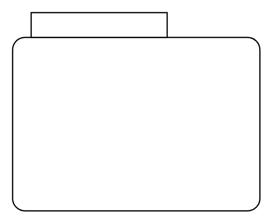

# Composite State 2

## Definition

```
{
  _style: { 
    entity: 'shape=mxgraph.sysml.compState;html=1;align=left;verticalAlign=top;spacingTop=-3;spacingLeft=18;',
  },
  _width: 200,
  _height: 160,
}
```

## Usage

```
import { CompositeState2 } from '@diac/standard-components-diagrams/sysmlStateMachines'

<CompositeState2/>
```

## Preview


