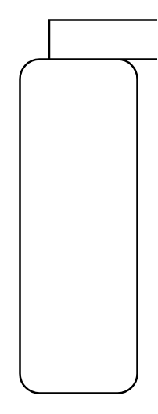

# Composite State

## Definition

```
{
  _style: { 
    entity: 'shape=mxgraph.sysml.compState;align=left;verticalAlign=top;spacingTop=-3;spacingLeft=18;strokeWidth=1;recursiveResize=0;html=1;',
  },
  _original_width: 0,
  _original_height: 190,
}
```

## Usage

```
import { CompositeState } from '@dinghy/standard-components-diagrams/sysmlStateMachines'

<CompositeState/>
```

## Preview


