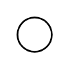

# Entry Point

## Definition

```
{
  _style: 'ellipse;html=1;labelPosition=left;verticalLabelPosition=bottom;spacingBottom=10;align=right;verticalAlign=bottom;resizable=0;',
  _width: 20,
  _height: 20,
}
```

## Usage

```
import { EntryPoint } from '@diac/standard-components-diagrams/sysmlStateMachines'

<EntryPoint/>
```

## Preview


