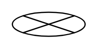

# Exit Point

## Definition

```
{
  _style: { 
    entity: 'shape=mxgraph.sysml.flowFinal;labelPosition=right;verticalLabelPosition=top;spacingTop=5;spacingLeft=3;align=left;verticalAlign=top;resizable=0;html=1;',
  },
  _original_width: 0,
  _original_height: 20,
}
```

## Usage

```
import { ExitPoint } from '@diac/standard-components-diagrams/sysmlStateMachines'

<ExitPoint/>
```

## Preview


