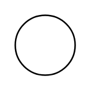

# History, Deep Pseudo State

## Definition

```
{
  _style: { 
    entity: 'shape=ellipse;html=1;fontSize=18;align=center;',
  },
  _original_width: 40,
  _original_height: 40,
}
```

## Usage

```
import { HistoryDeepPseudoState } from '@diac/standard-components-diagrams/sysmlStateMachines'

<HistoryDeepPseudoState/>
```

## Preview


