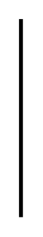

# Sysml State Machines Entities

- [Action](./action.md)  

- [ChoicePseudoState](./choice-pseudo-state.md)  

- [ChoicePseudoState2](./choice-pseudo-state-2.md)  

- [ChoicePseudoState3](./choice-pseudo-state-3.md)  

- [ChoicePseudoState4](./choice-pseudo-state-4.md)  

- [CompositeState](./composite-state.md)  

- [CompositeState2](./composite-state-2.md)  

- [EntryPoint](./entry-point.md)  

- [ExitPoint](./exit-point.md)  

- [FinalState](./final-state.md)  

- [HistoryDeepPseudoState](./history-deep-pseudo-state.md)  

- [InitialPseudoState](./initial-pseudo-state.md)  

- [ReceiveSignalAction](./receive-signal-action.md)  

- [Region](./region.md)  

- [SendSignalAction](./send-signal-action.md)  

- [SimpleState](./simple-state.md)  

- [SimpleState2](./simple-state-2.md)  

- [StateMachine](./state-machine.md)  

- [SubmachineState](./submachine-state.md)  

- [TerminateNode](./terminate-node.md)  

