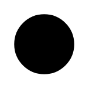

# Initial Pseudo State

## Definition

```
{
  _style: 'shape=ellipse;html=1;fillColor=strokeColor;fontSize=18;fontColor=#ffffff;',
  _width: 40,
  _height: 40,
}
```

## Usage

```
import { InitialPseudoState } from '@diac/standard-components-diagrams/sysmlStateMachines'

<InitialPseudoState/>
```

## Preview


