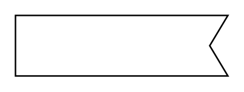

# Receive Signal Action

## Definition

```
{
  _style: { 
    entity: 'shape=mxgraph.sysml.accEvent;flipH=1;whiteSpace=wrap;align=center;html=1;',
  },
  _width: 140,
  _height: 40,
}
```

## Usage

```
import { ReceiveSignalAction } from '@diac/standard-components-diagrams/sysmlStateMachines'

<ReceiveSignalAction/>
```

## Preview


