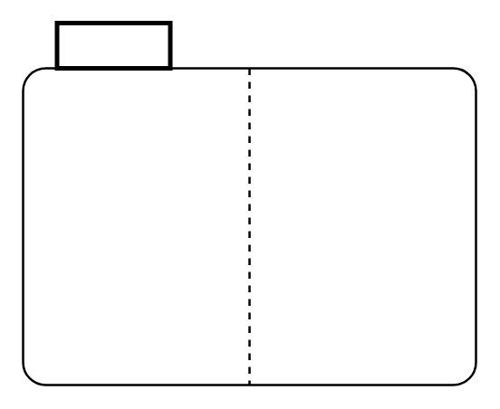

# Region

## Definition

```
{
  _style: { 
    entity: 'shape=mxgraph.sysml.region;align=left;verticalAlign=top;spacingTop=-3;spacingLeft=25;html=1;',
  },
  _original_width: 200,
  _original_height: 160,
}
```

## Usage

```
import { Region } from '@dinghy/standard-components-diagrams/sysmlStateMachines'

<Region/>
```

## Preview


