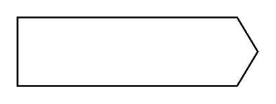

# Send Signal Action

## Definition

```
{
  _style: 'shape=mxgraph.sysml.sendSigAct;whiteSpace=wrap;align=center;html=1;',
  _width: 140,
  _height: 40,
}
```

## Usage

```
import { SendSignalAction } from '@reactiac/standard-components-diagrams/sysmlStateMachines'

<SendSignalAction/>
```

## Preview


