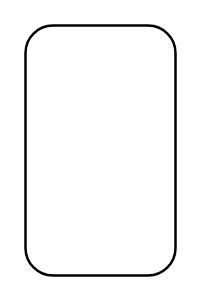

# Simple State 2

## Definition

```
{
  _style: { 
    entity: 'fontStyle=1;align=center;verticalAlign=middle;childLayout=stackLayout;horizontal=1;horizontalStack=0;resizeParent=1;resizeParentMax=0;resizeLast=0;marginBottom=0;rounded=1;absoluteArcSize=1;arcSize=22;',
  },
  _original_width: 0,
  _original_height: 100,
}
```

## Usage

```
import { SimpleState2 } from '@dinghy/standard-components-diagrams/sysmlStateMachines'

<SimpleState2/>
```

## Preview


