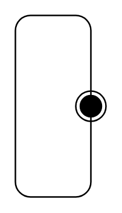

# State Machine

## Definition

```
{
  _style: 'shape=mxgraph.sysml.stateMachine;verticalAlign=top;whiteSpace=wrap;align=center;',
  _width: 0,
  _height: 120,
}
```

## Usage

```
import { StateMachine } from '@diac/standard-components-diagrams/sysmlStateMachines'

<StateMachine/>
```

## Preview


